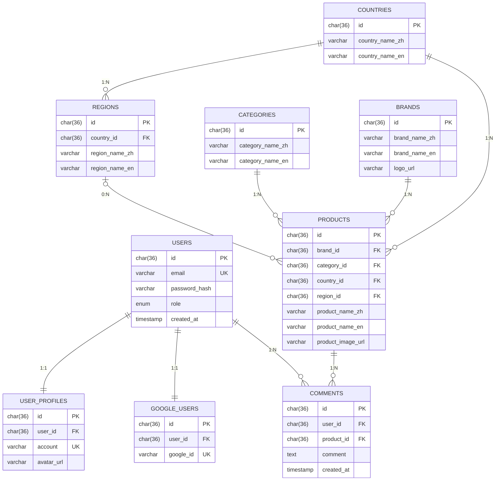

# Whisky Joy

This is web application for sharing whisky notes.
And I create it from userstory and Figma,ERD diagram,to Frontend,Backend,Deployment.

## 📌 Features

🔗 Live Demo: http://161.153.10.15/

## 🔑 Demo Account

You can try the system using the following accounts:

- **Admin**
  - Email: admin@gmail.com
  - Password: admin

- **User**
  - Email: a@gmail.com
  - Password: a

---

### 👤 User Features

- User Authentication (Login / Register)
- Browse Whisky Products
- Post Comments on Products
- Edit Profile (Nickname & Avatar)

### 🛠 Admin Features

- Admin Dashboard Access
- Product & Category Management (CRUD)

### 🔐 Security

- Role-Based Authorization (User / Admin)
- JWT Authentication
- Password Hashing (bcrypt)

---

## 🛠 Tech Stack

### 🎨 Frontend


### ⚙️ Backend


- RESTful API Architecture
- MVC Pattern (Model / Controller)
- Middleware-based Role Control (User / Admin)

### 🗄 Database


- UUID for ID

### 🚀 Deployment


- Docker Compose
- Oracle Cloud (Free Tier)
- Linux Server Deployment

---

## 🧩 Architecture Highlights

- Frontend & Backend Decoupled (SPA + API)
- RESTful API Design
- Role-Based Access Control (RBAC)
- Containerized Deployment with Docker

---

## 🚀 Getting Started

```bash
git clone https://github.com/AaronChen0627/Sideproject_whiskjoy.git
cd Sideproject_whiskjoy
docker-compose up -d
```

---

# Database ERD Diagram



## Project Structure

```
.
├── whiskyjoy-frontend/     # Vue.js 3 專案
│   ├── src/
│   │   ├── store/          # Vuex Modules (auth, products)
│   │   ├── router/         # Vue Router Guards
│   │   └── views/          # AddProduct.vue, etc.
│   ├── nginx.conf          # Nginx 配置
│   └── Dockerfile
├── whiskyjoy-backend/      # Node.js Express 伺服器
│   ├── controllers/        # 業務邏輯
│   ├── models/             # Sequelize/MySQL Models
│   ├── middlewares/        # JWT & Role Check
│   └── Dockerfile
└── docker-compose.yml      # 容器編排
```

### API Endpoints

## 🔌 API 參考文件 (API Reference)

本專案後端提供完整的 RESTful API，並透過 JWT 實作嚴謹的權限管理（分為：`Open`、`User`、`Admin`）。

### 1. 👤 Auth（身份驗證與使用者）

| 方法     | 路徑                 | 權限 | 描述                   |
| :------- | :------------------- | :--- | :--------------------- |
| **POST** | `/api/auth/register` | Open | 註冊新使用者           |
| **POST** | `/api/auth/login`    | Open | 使用者登入並獲取 JWT   |
| **POST** | `/api/auth/upload`   | User | 上傳使用者相關檔案     |
| **PUT**  | `/api/auth/profile`  | User | 更新使用者個人資料     |
| **GET**  | `/api/auth/userinfo` | User | 獲取當前登入使用者資訊 |

### 2. 🏷️ Brands（品牌管理）

| 方法       | 路徑              | 權限  | 描述                     |
| :--------- | :---------------- | :---- | :----------------------- |
| **GET**    | `/api/brands`     | Open  | 獲取所有品牌列表         |
| **POST**   | `/api/brands`     | Admin | 新增品牌                 |
| **GET**    | `/api/brands/:id` | Open  | 根據 ID 獲取單一品牌資訊 |
| **PUT**    | `/api/brands/:id` | Admin | 更新品牌資訊             |
| **DELETE** | `/api/brands/:id` | Admin | 刪除品牌                 |

### 3. 🗂️ Categories（分類管理）

| 方法       | 路徑                  | 權限  | 描述             |
| :--------- | :-------------------- | :---- | :--------------- |
| **GET**    | `/api/categories`     | Open  | 獲取所有分類列表 |
| **POST**   | `/api/categories`     | Admin | 新增分類         |
| **PUT**    | `/api/categories/:id` | Admin | 更新分類資訊     |
| **DELETE** | `/api/categories/:id` | Admin | 刪除分類         |

### 4. 🥃 Products（產品管理）

| 方法       | 路徑                        | 權限 | 描述                     |
| :--------- | :-------------------------- | :--- | :----------------------- |
| **GET**    | `/api/products/get-filters` | Open | 獲取產品篩選選單資料     |
| **GET**    | `/api/products`             | Open | 獲取所有產品列表         |
| **GET**    | `/api/products/:id`         | Open | 根據 ID 獲取單一產品詳情 |
| **POST**   | `/api/products`             | Open | 新增產品                 |
| **PUT**    | `/api/products/:id`         | Open | 更新產品資訊             |
| **DELETE** | `/api/products/:id`         | Open | 刪除產品                 |
| **POST**   | `/api/products/upload`      | Open | 上傳產品相關圖片         |

### 5. 💬 Comments（評論管理）

| 方法       | 路徑                       | 權限 | 描述                   |
| :--------- | :------------------------- | :--- | :--------------------- |
| **POST**   | `/api/comments/add`        | User | 新增產品評論           |
| **GET**    | `/api/comments/:productId` | Open | 獲取特定產品的所有評論 |
| **PUT**    | `/api/comments/:commentId` | User | 更新已發布的評論       |
| **DELETE** | `/api/comments/:commentId` | User | 刪除評論               |

### 6. 🌍 Countries & Regions（國家與產區管理）

| 方法       | 路徑                                | 權限  | 描述                           |
| :--------- | :---------------------------------- | :---- | :----------------------------- |
| **GET**    | `/api/countries`                    | Open  | 獲取所有國家列表               |
| **POST**   | `/api/countries`                    | Admin | 新增國家                       |
| **DELETE** | `/api/countries/:id`                | Admin | 刪除國家（連動刪除其下屬區域） |
| **GET**    | `/api/countries/:countryId/regions` | Open  | 獲取特定國家的所有產區/區域    |
| **POST**   | `/api/countries/regions`            | Admin | 新增區域（需指定隸屬國家）     |
